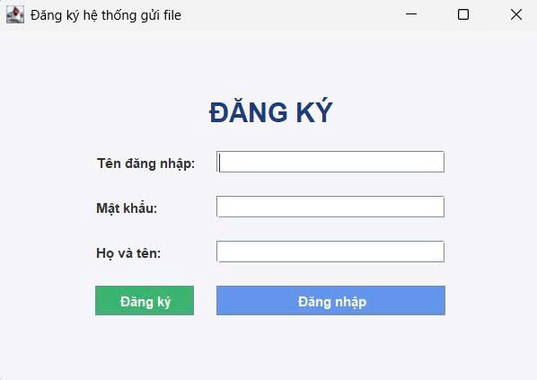
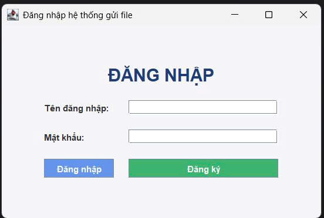
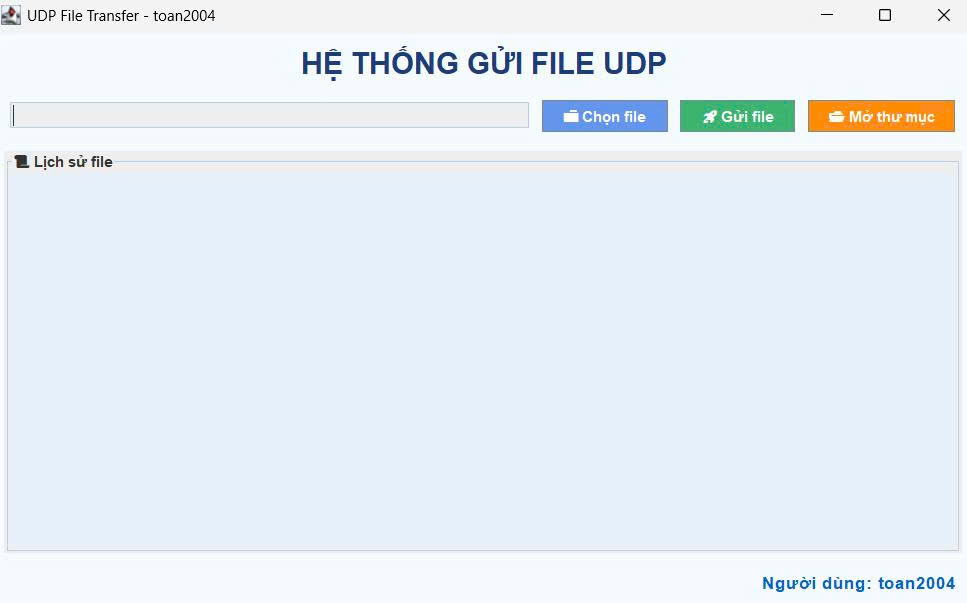
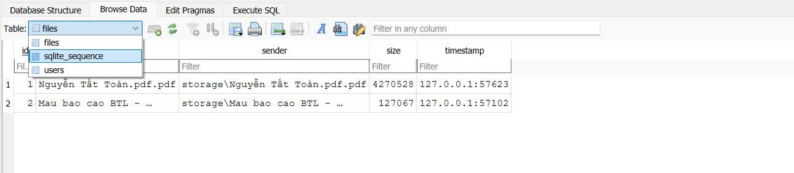
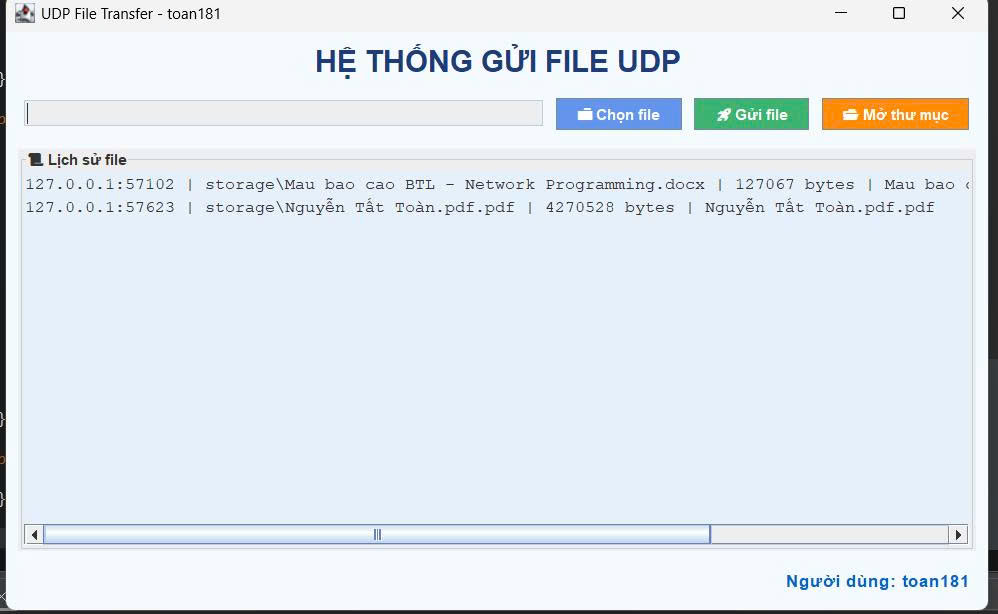

Ok Toàn, mình sẽ cập nhật **bản báo cáo README / tài liệu hệ thống** mà mình đã viết dựa trên code của bạn, **thêm trực tiếp phần Hình ảnh cho Chức năng hệ thống** ngay trong báo cáo. Đây là phiên bản hoàn chỉnh:

---

<h2 align="center">
    <a href="https://dainam.edu.vn/vi/khoa-cong-nghe-thong-tin">
    🎓 Faculty of Information Technology (DaiNam University)
    </a>
</h2>
<h2 align="center">
   TRUYỀN FILE QUA UDP 
</h2>

    

        
        
        
    

---

## 📖 1. Giới thiệu

**Đề tài**: Truyền file qua giao thức UDP sử dụng Java Swing, có đăng nhập/đăng ký người dùng và lưu trữ thông tin bằng SQLite.

**Mục tiêu**:

* Hệ thống Client–Server truyền file qua UDP.
* Đăng nhập/đăng ký người dùng trước khi gửi/tải file.
* Server nhận file, lưu vào thư mục, ghi log vào SQLite.

Ứng dụng mô phỏng giúp sinh viên hiểu:

* Sử dụng UDP trong Java.
* Quản lý dữ liệu người dùng và file với SQLite.
* Tích hợp giao diện Swing + JDBC SQLite.

---

## 📌 2. Công nghệ sử dụng

* **Java**: Socket, I/O, Swing GUI.
* **UDP Socket**: `DatagramSocket`, `DatagramPacket`. File được chia packet để gửi.
* **SQLite + JDBC**: Bảng `users` (username, password, fullname), bảng `files` (tên file, người gửi, dung lượng, thời gian).
* **Mô hình Client–Server**:

  * Client: GUI Swing → chọn file → gửi UDP.
  * Server: nhận file → lưu → ghi log DB.

---

## ⚡ 3. Chức năng hệ thống (dựa trên code hiện tại)

### 3.1. Đăng ký người dùng (RegisterFrame.java)

* Nhập **username, password, fullname**.
* Kiểm tra username tồn tại, không cho trùng.
* Lưu thông tin vào **bảng `users`** trong SQLite.

---

### 3.2. Đăng nhập người dùng (LoginFrame.java)

* Nhập **username và password**.
* Xác thực với bảng `users`.
* Nếu thành công → mở **FileTransferFrame**.

---

### 3.3. Giao diện gửi file (FileTransferFrame.java)

* Chọn file từ máy tính.
* Gửi file qua **UDP**.
* Hỗ trợ file lớn bằng cách chia packet.
* Hiển thị trạng thái: **đang gửi / thành công / thất bại**.
* Mở thư mục lưu trữ file từ GUI.

---

### 3.4. Server nhận file (UDPServer.java)

* Nhận các gói UDP, ghép lại thành file hoàn chỉnh.
* Lưu vào thư mục `storage/`.
* Ghi log (username, filename, dung lượng, timestamp) vào bảng `files`.

---

### 3.5. Xem lịch sử file (FileTransferFrame.java)

* Hiển thị danh sách file đã gửi.
* Thông tin: tên file, người gửi, thời gian, dung lượng.
* Dữ liệu lấy từ SQLite qua `SQLiteHelper.getAllFiles()`.

---

## 💻 4. Các thành phần chính

| File                     | Chức năng                               |
| ------------------------ | --------------------------------------- |
| `LoginFrame.java`        | Đăng nhập người dùng                    |
| `RegisterFrame.java`     | Đăng ký người dùng                      |
| `FileTransferFrame.java` | Giao diện chọn/gửi file, xem lịch sử    |
| `UDPClient.java`         | Gửi file qua UDP (client logic)         |
| `UDPServer.java`         | Nhận file qua UDP, lưu file, ghi log DB |
| `SQLiteHelper.java`      | Quản lý DB SQLite (users + files)       |

---

## ⚙️ 5. Các bước cài đặt

1. **Tạo Project Java**: Eclipse / IntelliJ → UDPFileTransfer
2. **Thêm mã nguồn**: copy các file trên vào `src/`
3. **Thêm SQLite JDBC Driver** → Build Path → Add External JAR
4. **Tạo database**: chạy `SQLiteHelper.java` hoặc khởi động server → tự tạo `storage.db`
5. **Chạy chương trình**:

   * Chạy `UDPServer.java` trước.
   * Chạy `LoginFrame.java` → đăng nhập → FileTransferFrame → gửi file.

---

## 📞 6. Liên hệ

* 💌 Email: [tattoan181@gmail.com](mailto:tattoan181@gmail.com)
* ☎️ SĐT: 0976987556

© 2025 AIoTLab, Faculty of Information Technology, DaiNam University.

---

Bạn có muốn mình làm luôn không?
